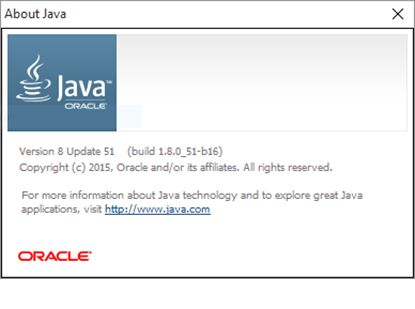

# Work Zone ITS Tool

*Companion tool for the [FHWA Work Zone Intelligent Transportation Systems Implementation Guide](https://ops.fhwa.dot.gov/publications/fhwahop14008/fhwahop14008.pdf)*

## Introduction

The WZITS Implementation Tool implements the logic and methodology described in the 
[FHWA Work Zone Intelligent Transportation Systems Implementation Guide](https://ops.fhwa.dot.gov/publications/fhwahop14008/fhwahop14008.pdf)
users should refer to the guide for information about the underlying methods incorporated into the tool. The tool creates
and manages a project file that provides users with (a) guidance during the WZITS decision making
process, and (b) a place to document the decisions made, along with relevant supporting 
information. The [user guide] includes four case studies that illustrate the use of the tool.

### Overview

ITS is the use of a broad range of communications-based information and electronics
technologies to enhance transportation (1). Work zone ITS is the use of ITS to improve safety and
mobility in and around work zones. Information provided by work zone ITS may be in the form of
real-time traffic conditions, such as travel delays through a work zone, or recommended
diversion routes. This information can be used by motorists to alter their travel behavior, and by
contractors and transportation agencies to alter traffic control strategies, traveler information, or
work schedules. A work zone ITS deployment can be focused solely around safety or mobility,
but it often supports both goals and can also help enhance productivity.

The WZITS Implementation Tool provides three core types of inputs, guidance, and
documentation:

1. *Project Information*
2. *Project Wizards*
3. *Project Documentation*

*Project Information* inputs provide project reference information for the work zone and allow the
user to add customized project documentation in addition to the standard inputs. General
information about the overall roadway facility and the work zone scenario can also be specified
using these inputs.

*Project Wizards* aggregate user inputs according to the guidance of the *Work Zone ITS
Implementation Guide*. The wizards also provide decision-support through recommendations
relating to project goals, ITS feasibility, team members and stakeholders, and potential ITS
applications. The user can then combine the tool’s recommendations with their own knowledge
about a specific roadway and work zone when making decisions.

Lastly, *Project Documentation* questions reflect the guidance of the *Work Zone ITS
Implementation Guide*. These questions are intended to ensure that the user has considered
particular steps or aspects of the implementation process. This section of the tool also provides a
place to document the decisions made over the course of the project.

## Installation

### Java Requirements
The WZITS Implementation Tool has been developed using the Java programming language
and version 8 or newer of the Java SE Runtime Environment (JRE) is required to run the tool. Any
version of Java 8 will be sufficient, but it is generally preferable to have the most up-to-date
version whenever possible. There are a number of ways to check if the installed version of Java is
sufficient or up-to-date, as described in the following section. For Release Version 1.0, a version
of Java 8 should be installed.

#### Checking the Java Version - Windows

The Java Control Panel provides information about the version of the JRE installed on the
computer. To find the Java Control Panel in Windows 7 and earlier, open the Windows Control
Panel and enter “java” in the search bar. In Windows 10, type “java” in the search bar located
with the taskbar at the bottom of the window and select the “Configure Java” desktop app.
Once the Java Control Panel is open, click the “About…” button in the “General” tab to display
a window displaying the version number, as shown in Figure 1.

If the search does not return any results, it is likely that the JRE is not installed on the computer. An
alternative way to check is to open a Command Prompt window and type the command
“java-version”. If this command returns an error or the output does not say “java version 1.8.0_xx”
(xx can be any number), then the JRE will need to be installed or updated.

#### Mac OS and Linux Users

On Mac OS computers, the Java Control Panel provides information about the version of the JRE
installed on the computer. To find it, open System Preferences from the Apple menu, and click
the Java icon at the bottom of the window. A message will appear stating that the Java Control
Panel will open in a new window; click to continue. Once the Java Control Panel is open, click
the “About…” button in the “General” tab to display a window displaying the version number,
similar to that shown in Figure 1. If the Java icon cannot be found in System Preferences, Java is
likely not installed on the computer (Java must be reinstalled each time the Mac OS is updated).

An alternative way to check the installed version of Java on either a Mac OS or Linux computer
is to use the “Terminal” application. On a Macintosh, Terminal can be found using the
Launchpad or by performing a Spotlight search. Once in the terminal, type the “java –version”
command. If this command returns an error or the output does not say “java version 1.8.0_xx” (xx
can be any number), then the JRE will need to be installed or updated.

### Installation and Running
To install the WZITS Implementation Tool, download or copy the WZITS_Tool.zip file to the desired
location on the computer. Next, extract the contents of the zip archive. **This is a key step
because the tool cannot be run while in an archived state.** Some computers will extract the files
from the archive automatically if the .zip file is double-clicked, but on many Windows computers
the extraction must be done explicitly.

To extract the contents of the archive, right-click on the .zip file and select the “Extract” option.
Alternatively, if the .zip file has been opened, choose the Extract tab and select the “Extract All”
option. In either case, the user will be asked to specify a location for the extracted files.

Once the files have been extracted, the WZITS Implementation Tool can be run immediately by
double-clicking on the WZITS_Tool.jar icon—no further installation is required.
