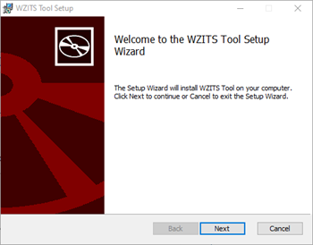
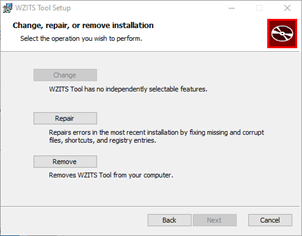

# Work Zone ITS Tool (Version 2.0)

*Companion tool for the [FHWA Work Zone Intelligent Transportation Systems Implementation Guide](https://ops.fhwa.dot.gov/publications/fhwahop14008/fhwahop14008.pdf)*

Quick Links:
* [Version 2.0 Changes](#version-two-changes)
* [Installation](#installation)
* [Download Latest Jar Release](https://github.com/kittelson/WZITS_Tool/releases)

## Introduction

The **WZITS Implementation Tool** implements the logic and methodology described in the 
[FHWA Work Zone Intelligent Transportation Systems Implementation Guide](https://ops.fhwa.dot.gov/publications/fhwahop14008/fhwahop14008.pdf). 
Users should refer to the guide for information about the underlying methods incorporated into the tool. The tool creates
and manages a project file that provides users with (a) guidance during the WZITS decision making
process, and (b) a place to document the decisions made, along with relevant supporting 
information. The [user guide](WZITS%20User%20Guide%20V2_0.pdf) includes four case studies that illustrate the use of the tool.

### Overview

ITS is the use of a broad range of communications-based information and electronics
technologies to enhance transportation. Work zone ITS is the use of ITS to improve safety and
mobility in and around work zones. Information provided by work zone ITS may be in the form of
real-time traffic conditions, such as travel delays through a work zone, or recommended
diversion routes. This information can be used by motorists to alter their travel behavior, and by
contractors and transportation agencies to alter traffic control strategies, traveler information, or
work schedules. A work zone ITS deployment can be focused solely around safety or mobility,
but it often supports both goals and can also help enhance productivity.

The WZITS Implementation Tool provides three core types of inputs, guidance, and
documentation:

1. *Project Information*
2. *Project Wizards*
3. *Project Documentation*

*Project Information* inputs provide project reference information for the work zone and allow the
user to add customized project documentation in addition to the standard inputs. General
information about the overall roadway facility and the work zone scenario can also be specified
using these inputs.

*Project Wizards* aggregate user inputs according to the guidance of the *Work Zone ITS
Implementation Guide*. The wizards also provide decision-support through recommendations
relating to project goals, ITS feasibility, team members and stakeholders, and potential ITS
applications. The user can then combine the tool’s recommendations with their own knowledge
about a specific roadway and work zone when making decisions.

Lastly, *Project Documentation* questions reflect the guidance of the *Work Zone ITS
Implementation Guide*. These questions are intended to ensure that the user has considered
particular steps or aspects of the implementation process. This section of the tool also provides a
place to document the decisions made over the course of the project.

### Version 2.0 Changes
* Enhanced user-friendliness and interface facelift – simplified tool navigation with a more modern look and feel.
* Streamlined installation process, now independent of Java – Users no longer need to have Java installed on their computer to use WZITS, simply download the Windows Installer file (.msi) and install.
* Ability to change wizard scoring by agency using the [Master Matrix Generator](Master_Matrix_Generator_V3.xlsm).
* Streamlined presentation of documentation steps 3 through 6
* Fact sheet improvements
* Comment Fields for most data entries – Comments useful for justification or reasoning for a certain selection. 
* Bug fixes and minor updates – Notably the concept of operations image now correctly saves with the file. 

## Installation

To install the Work Zone ITS Implementation tool, download the Windows installer file (.msi) 
[here](https://github.com/kittelson/WZITS_Tool/releases). Once the file has downloaded, double-click the file to launch
a guided installation wizard. Follow the instructions of the installation wizard to install WZITS.  

If desired, a specific install location can be specified for the program, but in general the standard location 
in C:\Program Files\WZITS TOOL should suffice for most users.  Note that installing the program will 
require administrator privileges for the computer.

Once the installation wizard has finished, both a desktop shortcut and a start menu item will have been created and can
be used to launch the program.

### Uninstalling the tool

There are two options to uninstall WZITS.  First, if the original installer is available, launching the install wizard
provides an option to uninstall the WZITS tool.  Alternatively, the WZITS tool can be uninstalled using the 
“Add or Remove Programs” Windows built-in utility.

